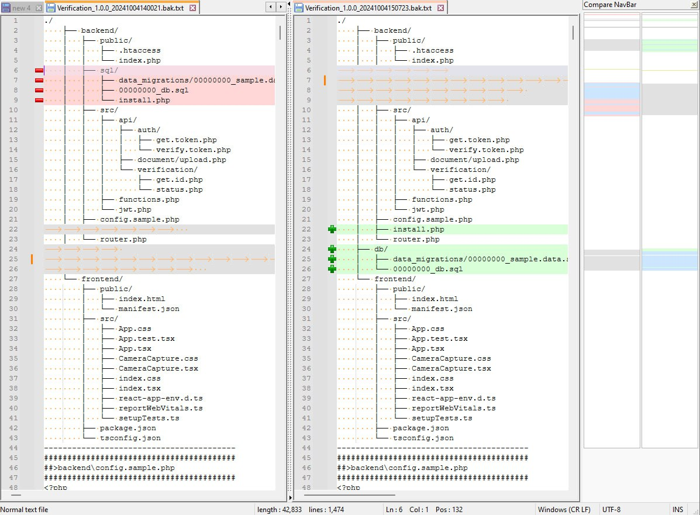
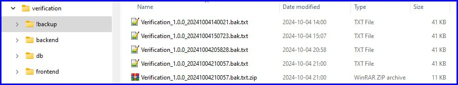
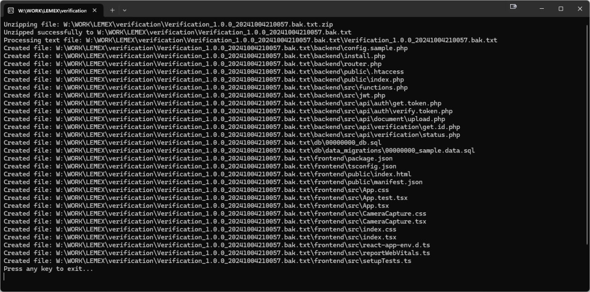
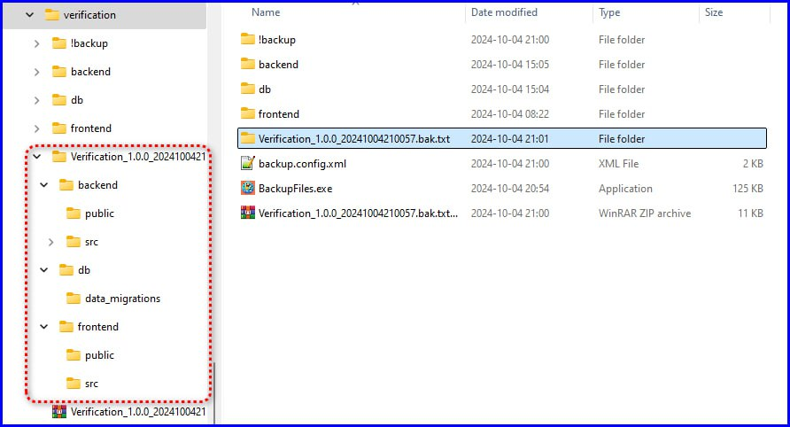

# 🗃️ BackupFiles

**BackupFiles** is a simple C# console application designed to create backups of project source files and restore them when needed.  
It collects all files with the specified extensions from defined directories, generates a single text backup file containing the entire project structure, and optionally compresses the result into a ZIP archive.

Recent versions add multiple configuration files, wildcard-based exclude rules, forced include files, update checks, dry-run mode, logging levels, size/age limits, and cleanup of old backups.

---

## 🚀 Features

- 🔍 Scans files by specified extensions  
- 📁 Supports include/exclude path filters  
- ✨ Wildcard-based exclude rules (e.g. `*.min.js`, `*/node_modules/*`, `backup.*.config.xml`)  
- ❗ Forced include files via `IncludeFiles` entries ending with `!` (ignore exclude rules)  
- 🧰 Multiple configs:
  - Run without arguments → use default `backup.config.xml`
  - Drag & drop any XML config onto `BackupFiles.exe` → use that config for backup
- ?? Incremental backups (only files changed since last backup)
- ?? Dry-run mode (preview without writing a backup)
- ?? Log levels (quiet/normal/verbose) + optional log file
- ?? Size/age limits to skip large or old files
- ?? Auto-cleanup of old backups by count or age
- 🧩 Generates a tree view of folder structure  
- 🧾 Saves all file contents into a `.bak.txt` file  
- 🗜️ Optional ZIP compression of the result  
- 🔄 Automatic version increment after backup  
- ♻️ Can restore the entire project from a `.bak.txt` file or from a `.zip` created by the tool

---

## 🏗️ Project Structure

```
BackupFiles/
├── app.config
├── app.version.cs
└── src/
    ├── classes.cs
    └── Main.cs
```

---

## ⚙️ Configuration

Main build parameters are defined in **`app.config`**:

```xml
<configuration>
  <company_name>LEMEX</company_name>
  <project_name>BackupFiles</project_name>
  <project_title>Backup Files</project_title>
  <description>Simple Backup of Project Files</description>

  <major_version>1</major_version>
  <minor_version>0</minor_version>
  <build_configuration>Release</build_configuration>
  <build_target>exe</build_target>

  <lib_folders>lib,src</lib_folders>
  <icon_file_path>.\res\icon.ico</icon_file_path>

  <release_version>24</release_version>
  <build_version>24</build_version>
</configuration>
```

---

### 🔧 User Configuration File `backup.config.xml`

User-level backup settings are defined in **`backup.config.xml`** located next to the executable.

If the file is missing, the application will create an auto-generated template on first launch, which now includes an instructional comment block:

```xml
<!-- HOW TO USE THIS FILE
1. This file defines which files and folders will be included in your backup.
2. IncludePaths – folders scanned recursively.
3. IncludeFiles – specific files added manually.
   - If a file ends with "!", it ignores ExcludePaths and will ALWAYS be included.
4. ExcludePaths – wildcard patterns for files/folders to exclude.
5. Extensions – allowed file formats.
6. ResultPath – folder where backups will be saved.
7. ResultFilenameMask – pattern used to build the backup filename.
8. Created - last backup timestamp (updated automatically).
9. UpdateCheckMinutes - update check interval in minutes (0 disables).
10. UpdateCheckTimeoutSeconds - update check timeout in seconds.
11. UpdateCheckVerbose - detailed update check logs (true/false).
12. DryRun - preview files without writing a backup (true/false).
13. LogLevel - quiet | normal | verbose.
14. LogToFile - enable log file output (true/false).
15. LogFilePath - log file path (relative to exe if not absolute).
16. IncrementalBackup - include only files changed since last backup (true/false).
17. MaxFileSizeMB - exclude files larger than this size (0 disables).
18. MaxFileAgeDays - exclude files older than N days (0 disables).
19. CleanupKeepLast - keep only last N backups (0 disables).
20. CleanupMaxAgeDays - delete backups older than N days (0 disables).
21. IsExample=1 disables work. Set it to 0 before using.
22. To use this config, drag & drop it onto the BackupFiles.exe application.
END OF INSTRUCTIONS -->
```

Example template (simplified):

```xml
<configuration>
  <ProjectName>MyProject</ProjectName>
  <Version>1.0.0</Version>
  <Created>YYYY-MM-DD hh:mm:ss</Created>
  <UpdateCheckMinutes>1440</UpdateCheckMinutes>
  <UpdateCheckTimeoutSeconds>5</UpdateCheckTimeoutSeconds>
  <UpdateCheckVerbose>false</UpdateCheckVerbose>
  <DryRun>false</DryRun>
  <LogLevel>normal</LogLevel>
  <LogToFile>false</LogToFile>
  <LogFilePath>./backup.log</LogFilePath>
  <IncrementalBackup>false</IncrementalBackup>
  <MaxFileSizeMB>0</MaxFileSizeMB>
  <MaxFileAgeDays>0</MaxFileAgeDays>
  <CleanupKeepLast>0</CleanupKeepLast>
  <CleanupMaxAgeDays>0</CleanupMaxAgeDays>

  <extensions>
    <extension>.config</extension>
    <extension>.cs</extension>
  </extensions>

  <includePaths>
    <includePath>./include</includePath>
  </includePaths>

  <excludePaths>
    <excludePath>./exclude</excludePath>
  </excludePaths>

  <ResultPath>./output</ResultPath>
  <ResultFilenameMask>@PROJECTNAME_@VER_#YYYYMMDDhhmmss#.bak.txt</ResultFilenameMask>

  <EnableZip>true</EnableZip>
  <DeleteUnziped>true</DeleteUnziped>

  <IsExample>0</IsExample>
</configuration>
```

Note on `extensions`: these are filename masks now.  
Examples: `.js` ⇒ `*.js`, `.min.js` ⇒ `*.min.js`.  
Rules are applied from the longest mask to the shortest, so `*.min.js` wins over `*.js`.

#### Advanced configuration (recent versions)

- **Wildcard exclude rules** in `ExcludePaths`:
  - `*.min.js` – exclude all minified JS files
  - `*/node_modules/*` – exclude any content inside any `node_modules` directory
  - `backup.*.config.xml` – exclude all config variations matching this mask
- **Forced include files** in `IncludeFiles`:
  - `./backup.web.config.xml` – included only if it does **not** match exclude patterns
  - `./backup.api.config.xml !` – included **even if** it matches `ExcludePaths`
- **Multiple configs**:
  - You can maintain several XML configs (e.g. `backup.web.config.xml`, `backup.api.config.xml`) next to the application and run a backup with any of them by drag & dropping the config onto `BackupFiles.exe`.
- **Update check**:
  - `UpdateCheckMinutes` - interval in minutes (0 disables).
  - `UpdateCheckTimeoutSeconds` - HTTP timeout in seconds.
  - `UpdateCheckVerbose` - detailed update check logs.
  - `Created` - last backup timestamp, updated automatically.
- **Dry-run**:
  - `DryRun` - preview what would be packed without writing a backup.
- **Incremental backup**:
  - `IncrementalBackup` - include only files changed since the last backup (based on `Created`).
- **Logging**:
  - `LogLevel` - quiet | normal | verbose.
  - `LogToFile` / `LogFilePath` - write console output to a file.
- **Limits**:
  - `MaxFileSizeMB` - skip files larger than this size.
  - `MaxFileAgeDays` - skip files older than N days.
- **Cleanup**:
  - `CleanupKeepLast` - keep only last N backups.
  - `CleanupMaxAgeDays` - delete backups older than N days.

---

## 💡 Usage

### 1️⃣ Create a Backup (default config)

1. Make sure `backup.config.xml` is present and configured.  
2. Run the program **without arguments**:

   ```bash
   BackupFiles.exe
   ```

3. The application will generate a backup file in the configured output folder (`ResultPath`).

### 2️⃣ Create a Backup with a Custom Config

1. Create an alternative config, e.g. `backup.web.config.xml`.  
2. Drag & drop this XML file onto `BackupFiles.exe`.  
3. Backup will be created using that config instead of the default one.

### 3️⃣ Restore a Project from `.bak.txt` or `.zip`

1. To restore from a text backup:

   ```bash
   BackupFiles.exe MyBackup_1.0.0_20251011.bak.txt
   ```

2. To restore from a ZIP archive created by the tool:

   ```bash
   BackupFiles.exe MyBackup_1.0.0_20251011.bak.txt.zip
   ```

   The application will automatically unzip the file to a temporary folder and recreate the project structure.

Restored project files will be placed in a new directory named after the backup file.

---

## 🧮 Backup Filename Format

The backup file name is generated based on the mask in the config:

```
@PROJECTNAME_@VER_#YYYYMMDDhhmmss#.bak.txt
```

Example output:

```
BackupFiles_1.0.7_20251011104647.bak.txt
```

If ZIP compression is enabled, the resulting file will have `.zip` appended:

```
BackupFiles_1.0.7_20251011104647.bak.txt.zip
```

---

## 🪄 PowerShell Commands for Archiving

If `EnableZip = true` is enabled, the following commands are used internally:

To zip:

```powershell
Compress-Archive -Path "sourcefile" -DestinationPath "destination.zip"
```

To unzip:

```powershell
Expand-Archive -Path "backup.zip" -DestinationPath "folder"
```

---

## 🖼️ Examples

### 🔸 Comparing Two Backups

You can easily compare different versions of backups in a diff tool such as *WinMerge*, *Notepad++* or *Beyond Compare*  
— perfect for seeing file and structure changes without using Git.



---

### 🔸 Backup Storage Examples

Backups are stored as plain text `.bak.txt` files and optionally compressed into `.zip` archives.



---

### 🔸 Project Restoration

You can restore an entire project structure (files and directories) directly from `.bak.txt` or `.zip`.  
Below are three stages of restoration:

1. Launching BackupFiles and selecting the archive  
   

2. Console output during extraction and file creation  
   

3. Fully restored project structure in Windows Explorer  
   

---

## 🧑‍💻 Author

**Maxim Hegel © 2025**  
📧 [i@hgl.mx](mailto:i@hgl.mx)  
🔗 [LinkedIn](https://www.linkedin.com/in/maximhegel)

---

## 📜 License

MIT License — free to use and modify with attribution.

